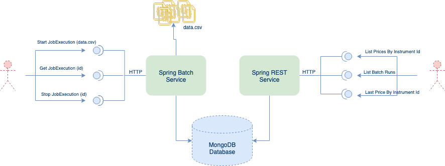

# spring-mongodb-poc

PoC that loads data into MongoDB via a Spring Batch job, and allows several queries on this data.

## Tech Stack

- Java 8
- Spring Framework 5
- Spring Boot
- Spring Webflux/Reactor
- Spring Data/MongoDB
- Spring Batch
- Lombok
- Mockito
- Travis CI
- Docker/Docker Compose

## Architecture

The system has been designed to decouple the consumers from the producers, so they can be scaled indepdently, putting most of the weight on a shared Mongodb database, that can and must be scaled independently to support bigger data sets.



- **Spring Batch Service**: Spring Boot application implementing a Spring Batch Job that can be triggered
  via an HTTP interface, exposed by the batch-web-spring-boot-starter library craeted by Codecentric.
  The producer can lunch several concurrent jobs via HTTP requests, indicating the file name belonging to one of the files stored in the dataset directroy. The data files are processed in chunks of 10K, but this can be easly modified via an environment variable, once the job is finished, the state of the Batch run linked to all the price records processed for that Job will be updated as COMPLETED. The data files must be in csv format, like the examples located in the [price-dataset](price-dataset) directory.

- **Spring Rest Service**: This service implements endpoints to list the batch runs, prices and to query the last price of a given instrumentId.

- **Spring Rest Service**: All the prices are stored in a prices collection in MongoDB, this collection has a compound index using the instrumentId and asOf fields. For each batch run a batch document is created in the batches collection, which can be used to track the state of the batch run, start and end dates.

## Build and Run

The source code is structured as a Maven multi project with the following modules:

- price-batch-service: Spring Batch service that offers a REST interface to lunch, cancel and query jobs that load data in the Mongo DB database.
- price-service: Spring Webflux REST API that offers endpoints to query prices and batch runs.

To build and run the entire project you can run the following commands:

```bash
$ git clone https://github.com/armandorvila/spring-mongodb-poc
$ cd spring-mongodb-poc
$ mvn clean install
$ docker-compose up --build -d
```

That will generate one JAR file for each service, it will build two fresh docker images for each one of them, and will run those two docker images along with a mongodb db.

Once the docker compose is up, you can consume the endpoints explained in the next section.

**NOTE**: You must have the ports 9000 and 9001 available on the host computer, otherwise you must adjust the compose file.

## Endpoints

The following table sums up the system endpoints, full examples based on curl can be found in the next section:

| Endpoint                                        | Method | Description                                                                                                                                                             |
| ----------------------------------------------- | ------ | ----------------------------------------------------------------------------------------------------------------------------------------------------------------------- |
| `/api/operations/jobs/loadPrices`               | POST   | Creates an asynchronous job execution for the loadPrices Spring Batch Job. Each request will lunch a new execution in background returning the execution id of the job. |
| `/api/operations/jobs/executions/{executionId}` | DELETE | Stops the job execution of the given ID.                                                                                                                                |
| `/api/monitoring/jobs/executions/{executionId}` | GET    | Retrieves the information for a given execution ID.                                                                                                                     |
| `/api/batches`                                  | GET    | Retrieves the batch runs from the database enforcing offset/size pagination.                                                                                            |
| `/api/prices?instrumentId={instrumentId}`       | GET    | Retrieves all the prices from the database by instrumentId, enforcing offset/size pagination.                                                                           |
| `/api/prices/last?instrumentId={instrumentId}`  | GET    | Get the last price for the given instrumentId, if no instrumentId is provided a 400 error is returned. If the instrumentId doesn't exist a 404 error is returned.       |

## Examples

**Starting a Job Execution**:

```bash
curl -H "Accept: application/json" -X POST http://localhost:9001/api/operations/jobs/loadPrices -d "jobParameters=dataFile=sample-data-2.csv"
```

**Retrieving a Job Execution**:

```bash
curl -H "Accept: application/json" http://localhost:9001/api/monitoring/jobs/executions/{executionId}
```

**Stopping a Job Execution**:

```bash
curl -H "Accept: application/json" -X DELETE http://localhost:9001/api/operations/jobs/executions/{executionId}
```

**Listing the batch runs**:

```bash
curl -H "Accept: application/json" http://localhost:9000/api/batches
```

**Listing prices (default offset:0, default limit 100)**:

```bash
curl -H "Accept: application/json" http://localhost:9000/api/prices?instrumentId=7f35ef04-4a7b-4934-9523-25a78def8cf1
```

**Getting the last price for an instrument ID**:

```bash
curl -H "Accept: application/json" http://localhost:9000/api/prices/last?instrumentId=7f35ef04-4a7b-4934-9523-25a78def8cf1
```

## Build

[](http://travis-ci.org/armandorvila/spring-mongodb-poc) [](https://codecov.io/github/armandorvila/spring-mongodb-poc) [](https://www.codacy.com/app/armandorvila/spring-mongodb-poc?utm_source=github.com&utm_medium=referral&utm_content=armandorvila/spring-mongodb-poc&utm_campaign=Badge_Grade)
